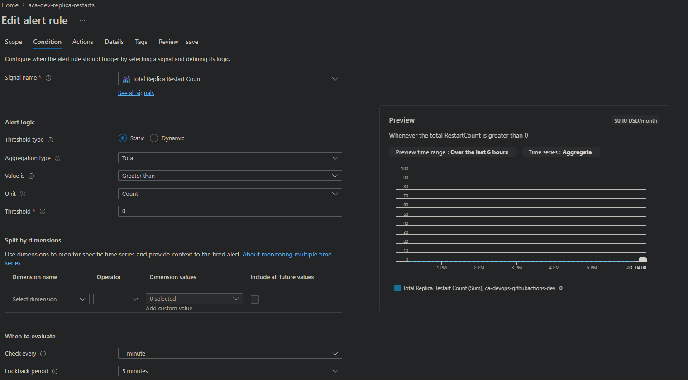
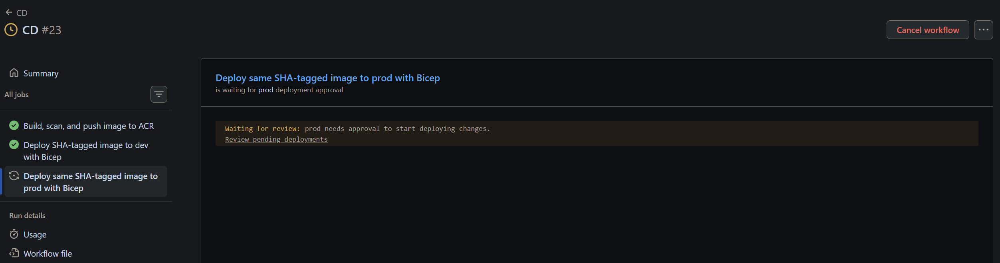
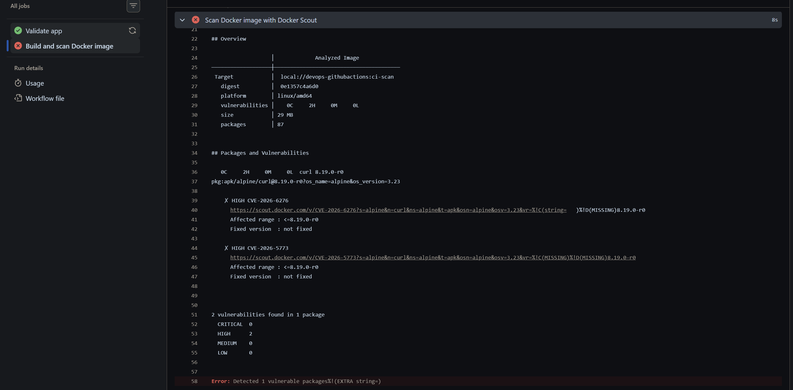

# DevOps with GitHub Actions

This is a personal DevOps/DevSecOps project leveraging GitHub Actions, Docker, Azure Container Registry, and Azure Container Apps.

The goal of this project is to learn how to build, validate, maintain, containerize, secure, and deploy a web app using a professional CI/CD pipeline.

## Security

This project utilizes Azure OpenID Connect to authenticate GitHub Actions requests with short-lived identity tokens.

Security is built into the CI/CD pipelines to ensure supply-chain security. npm audit and Docker Scout are leveraged in order to prevent known Common Vulnerabilities and Exposures (CVEs) from being pushed to the main branch.

## Stack
* HTML
* JavaScript
* Bicep
* Node.js / npm
* ESLint
* Vitest
* GitHub Actions
* Docker
* Azure Container Registry
* Azure Container Apps

## Architecture

### CI.YAML

Upon a Pull Request, this pipeline will first install the required dependencies. It will then validate the source code through checking for insecure code and exposed secrets, audit npm for supply chain vulnerabilties, and finally build the app. If there are high and/or critical severity CVEs found from the audit, the pipeline will fail and request remediation for them. Then, we will leverage Docker to build and scan the image for vulnerabilties in the Alpine base image. Again, the pipeline will fail if there are high and/or critical severity CVEs found in the base image.

### CD.YAML

Upon a successful completion of the CI.YAML workflow, this pipeline will first log in to Azure and Azure Container Registry (ACR) server to begin the deployment process. It will then set the image name to the exact Git commit SHA for improved versioning control, build and scan the release image, finally pushing the image to ACR. To emulate an enterprise environment, we will have two seperate development/production container apps to further validate and verify successful deployments. We will leverage Bicep to safely automate the deployment of the two seperate container apps and the respective user-assigned managed identities. Before deploying the dev container app, we must build a managed identity so the container app can authenticate to the private ACR and pull the release image for deployment. After successful propogation, the dev container app will be deployed with the Bicep template. The pipeline will pause after dev container deployment and await for successful validation from a trusted contributor. If the dev container is running with no errors, the contributor can resume the pipeline and deploy the image to prod.

### Azure Environment

In order for the continuous deployment pipeline to successfully log in to Azure and create deployments, a service principal is connected to this repository through OpenID Connect. The service prinicipal requires the following permissions to operate and deploy successfully:
* Contributor on the resource group of the project: allows GitHub Actions to deploy/update Azure resources with Bicep
* AcrPush on the private ACR: allows GitHub Actions to push the Docker image to Azure Container Registry
* User Access Administrator on the private ACR: allows GitHub Actions to create the AcrPull role assignment for the Container Apps managed identities

The Service Principal uses three federated credentials to enforce security gates at each stage of the deployment process: main branch, development environment, and production environment.

#### Monitoring and Observability

Application and Container environments require extensive monitoring to ensure 1. Successful deployments 2. Healthy apps/containers. For the containers, there are two alerts for both the dev and prod container apps. The alert shown in the picture below is to record potential crashes or failed revisions, which triggers an email to myself. The second alert will provide notification when there are requests that return 5xx errors, indicating server-side issues with the container environment.

## Proof of Concept

 

Production deployment awaiting approval after a success development deployment.

 

 

CI pipeline failed due to vulnerabilties in base image.